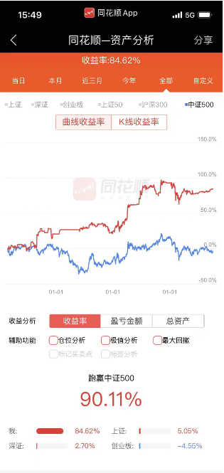

# 投资笔记

## 量化策略
&emsp;&emsp;量化策略对很多人来说还是很有实践意义的，总体来讲有这么几个优点。
  - 风险控制：量化策略持仓足够分散
  - 想法验证：可以充分利用历史数据回测自己的想法，你有个因子/指标/特征/公式，觉得很屌就去回测下试试，是否可行一试便知。
  - 计算速度：可以方便使用各种优化算法去优化自己的模型，肉身选股一只一只看要看很久，机器生成持仓最多十几秒。
  - 个人成长：量化对知识需求比较多，数学、统计、编程、机器学习，就算没搞好，下限也就是买入持有benchmark；而且一身竞争力。
  - 归因分析：可以快速生成自己持仓的行业暴露、市值偏好等，方便与基准进行对比，找出自己优缺点。
  
&emsp;&emsp;策略战绩：两年时间，交易胜率0.705，夏普比率2.03，对中证500超额收益100.22%，实盘应用于基金产品  

## 文财策略战绩
&emsp;&emsp;在这里干了两年投资总监，济南的小老板真是太坑了，白给你用了这么久的好策略。  

## 个人战绩更新
&emsp;&emsp;我好傻逼啊，2022年为什么要配置大盘股，都没有跑赢管理基金的策略！！！我要翻盘！！！  
&emsp;&emsp;(2023-03-23 update) 现在仓位比较低，随着加息周期临近尾声我会逐渐All in 再展雄风。  

