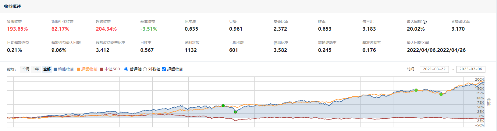

# 投资笔记

## 量化策略
量化策略对很多人来说还是很有实践意义的，总体来讲有这么几个优点。
  - 风险控制：量化策略持仓足够分散
  - 想法验证：可以充分利用历史数据回测自己的想法，你有个因子/指标/特征/公式，觉得很屌就去回测下试试，是否可行一试便知。
  - 计算速度：可以方便使用各种优化算法去优化自己的模型，肉身选股一只一只看要看很久，机器生成持仓最多十几秒。
  - 个人成长：量化对知识需求比较多，数学、统计、编程、机器学习，就算没搞好，下限也就是买入持有benchmark；而且一身竞争力。
  - 归因分析：可以快速生成自己持仓的行业暴露、市值偏好等，方便与基准进行对比，找出自己优缺点。
  
(2023-06-11 update) 最近一个月策略有点牛逼。。。  
策略战绩更新：（2021-03-22至2023-05-06），交易胜率0.657，夏普比率1.688，对中证500超额收益115.64%  

## 文财策略战绩
在这里干了两年投资总监，公司老板想推量化，可惜老板主观出身，实在太小白了，难以交流哎，白给他们用了这么久的好策略，任职期间策略回报如下：  
交易胜率0.785，夏普比率2.255，2019-06-03至2020-12-31期间对中证500超额收益为54.89%

## 个人战绩更新  
(2023-06-11) 仓位水平正在上升，另外期货账户已经配置IH和IF股指期货以作为大盘股底仓。  
(2023-05-06 update) 现在仓位比较低，随着加息周期临近尾声我会逐渐All in 再展雄风。  

